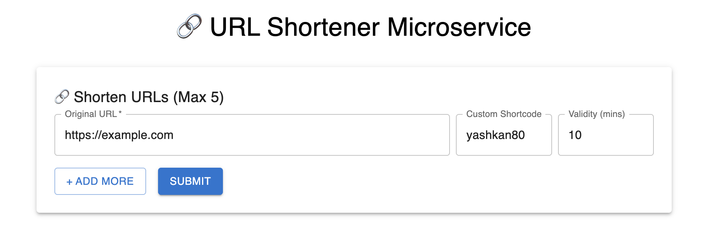
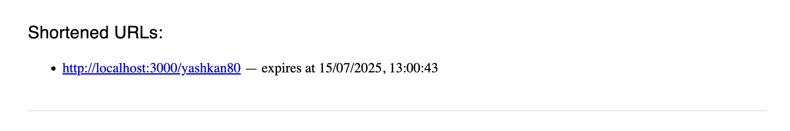
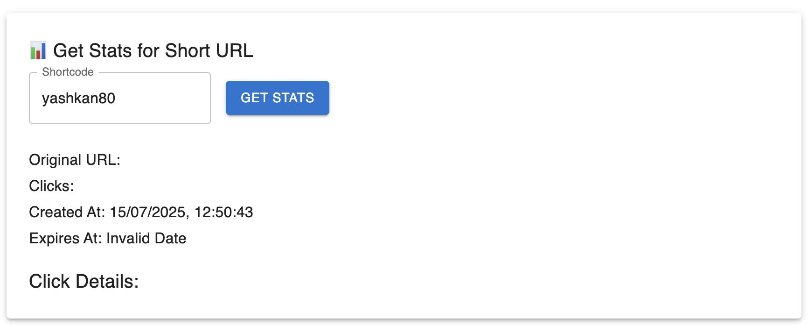

# Full Stack URL Shortener

## 👤 Info

- **GitHub Username:** [Kansal-ji](https://github.com/Kansal-ji)  
- **Roll Number:** 80

---

## Project Structure

```
80/
├── Logging Middleware/
│   └── index.js
├── Backend Test Submission/
│   ├── app.js
│   ├── server.js
│   ├── models/
│   ├── routes/
│   ├── middleware/
│   ├── controllers/
│   └── .env
├── Frontend Test Submission/
│   ├── src/
│   │   ├── App.js
│   │   ├── components/
│   │   └── config.js
│   └── public/
└── README.md

````

---

## Project Overview

This project is a **URL Shortener Microservice** built as part of the Full Stack Project evaluation.

### Key Functionalities

- Shorten long URLs (custom or auto shortcode)
- Set expiry (default 30 minutes)
- Track click statistics
- Geo & referer info tracking
- Secure access with `clientId` and `clientSecret`
- Full logging middleware for all requests

---

## Tech Stack

| Layer      | Technology            |
|------------|------------------------|
| Frontend   | React + Material UI    |
| Backend    | Node.js, Express       |
| Database   | MongoDB (Cloud Atlas)  |
| Logging    | Custom Middleware      |

---

## Setup Instructions

### 1. Clone the Repo

```bash
git clone https://github.com/Kansal-ji/80.git
cd 80
````

### 2. Backend Setup

```bash
cd "Backend Test Submission"
npm install
touch .env
```

Add the following to `.env`:

```env
MONGO_URI=your_mongo_connection_string
PORT=3000
CLIENT_ID=your_client_id
CLIENT_SECRET=your_client_secret
```

Start the server:

```bash
node server.js
```

---

### 3. Frontend Setup

```bash
cd "../Frontend Test Submission"
npm install
npm start
```

---

## API Endpoints

### Auth Headers

Every request must include:

```
clientid: your_client_id
clientsecret: your_client_secret
```

### POST `/shorturls`

```json
{
  "url": "https://example.com",
  "shortcode": "customcode",     
  "validity": 10                 
}
```

### GET `/shorturls/:shortcode`

Returns stats and metadata about the shortened URL.

---

## Logs

Custom logging middleware records:

* Timestamp
* HTTP Method
* Requested URL
* Response Time

Logs are output to the console during every API call.

---

## Output Screenshots

### Shorten URL Page (Form Input)


### Shorten URL Response


### URL Stats Page


